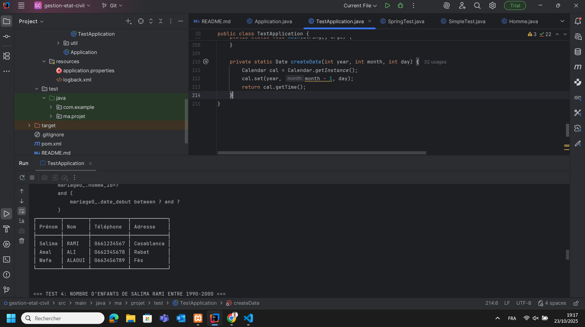
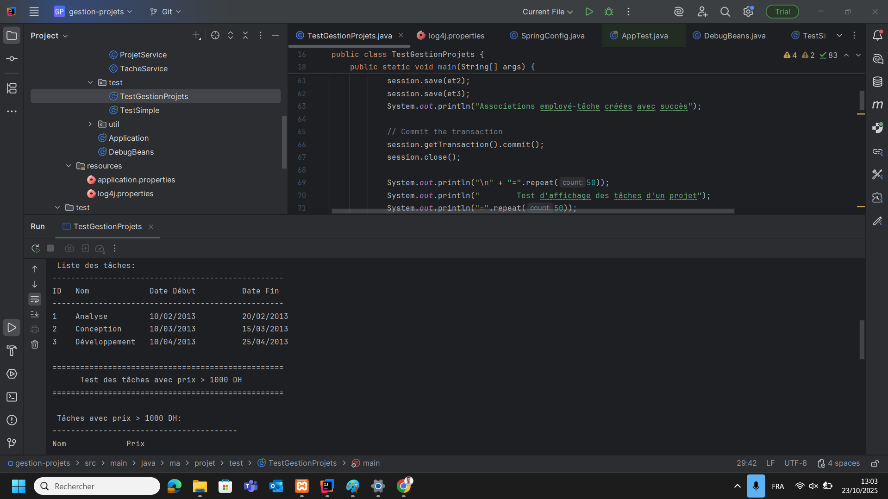
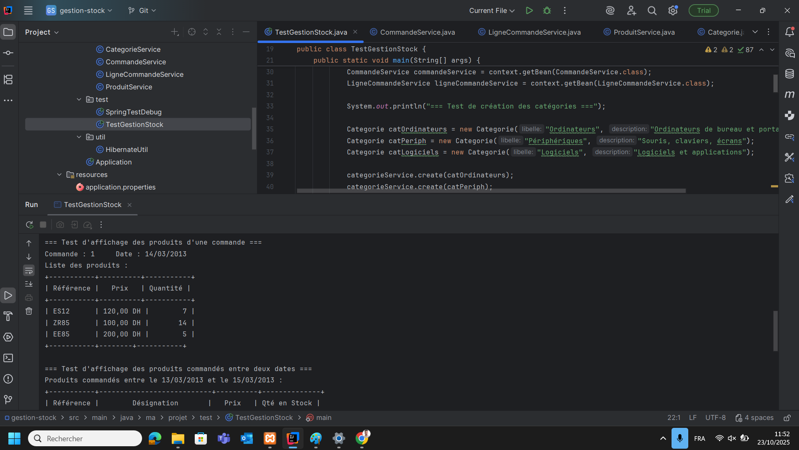

# 🗃️ Applications de Gestion

[](https://www.java.com/)  
[](https://spring.io/)  
[](https://hibernate.org/)  
[](https://maven.apache.org/)  
[](https://www.mysql.com/)

Ce référentiel contient **trois applications de gestion** développées en **Java** avec **Spring Framework** et **Hibernate**, chacune suivant l’architecture **DAO-Service** avec Spring pour la gestion des transactions et Hibernate pour la persistance des données.

---

## 📊 Tableau récapitulatif des applications

| Application | Entités principales | Fonctionnalités clés |
|------------|------------------|--------------------|
| **Gestion de l'État Civil** (`gestion-etat-civil/`) | Femme, Homme, Mariage | Gestion des actes civils, recherche femme la plus âgée, comptage enfants, femmes mariées plusieurs fois |
| **Gestion de Projets** (`gestion-projets/`) | Employe, Projet, Tache, EmployeTache | Gestion des employés, projets et tâches, suivi des tâches par employé, affichage projets par employé |
| **Gestion de Stock** (`gestion-stock/`) | Produit, Categorie, Commande, LigneCommande | Gestion produits/catégories, commandes, recherche par critères, affichage produits commandés entre dates |

---

## 📸 Captures d’écran / Démonstration

### 1️⃣ Gestion de l'État Civil

Gestion des naissances, mariages, décès et recherches avancées.


### 2️⃣ Gestion de Projets

Suivi des tâches, employés et projets avec dates de réalisation.

### 3️⃣ Gestion de Stock

Gestion des produits, catégories, commandes et inventaire.

> 💡 Remplace les liens `https://via.placeholder.com/...` par de vraies captures d’écran ou GIFs de tes applications pour un rendu plus professionnel.

---

## 🛠️ Technologies Utilisées

- **Java 8/11**  
- **Spring Framework 5.3.21** (IoC, Transactions, Tests)  
- **Hibernate 5.6.15.Final**  
- **Maven**  
- **MySQL 8.0.33**  
- **HikariCP 5.0.1** (pool de connexions performant)  
- **JUnit 4.13.2**  

---

## 🏗️ Architecture du Projet

- Couches **DAO-Service**  
- **Annotations Spring** : `@Service`, `@Transactional`, `@Autowired`, `@Configuration`  
- Gestion **déclarative des transactions**  
- Pool de connexions **HikariCP optimisé**  
- Tests unitaires et Spring Test intégrés  

---

## ⚡ Installation et Lancement

### Prérequis
- Java 8+  
- Maven 3.6+  
- MySQL 8.0+ (port 3307)  

### Compilation
```bash
cd gestion-etat-civil/  # ou gestion-projets/ ou gestion-stock/
mvn clean compile
